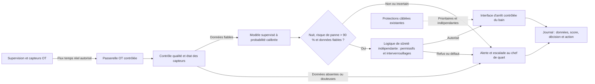

# Fiche de décision — <votre cas> (À COMPLÉTER)

**Client :** <nom, rôle> · **Groupe :** <prénoms> · **Cas <A/C/D>**

> **Livrable principal — 3-4 pages au maximum** (un plafond, pas une cible).
> Lisible par un architecte technique. Renommez en `dossier_conception.md`.
> Tout s'écrit **ici, une seule fois** : décisions, arbitrages, schéma et
> questions prévues. Tableaux plutôt que paragraphes.

---

## 1. Décisions de groupe (mardi 15h30-16h45)

> 3-5 points où vos cadrages M8-B1 divergeaient. Pas de compromis mou : un
> choix tranché et argumenté.

| Divergence | Positions (qui pensait quoi) | Décision retenue | Pourquoi |
| --- | --- | --- | --- |
| Prise en compte de la demande nocturne | Joëlle indique qu'aucune nouvelle contrainte n'a été communiquée et maintient une décision humaine, Romain rapporte la demande de la direction : arrêt automatique la nuit au-delà de 90 %, avec un seul chef d'équipe. | Considérer la demande comme une évolution réelle (exclure l'arrêt automatique du pilote en lecture seule). | Information manquante dans le cadrage de Joëlle. |
| Valeur probante de l'extrait capteurs | Joëlle observe une dérive sur les 48 h qui pourrait signaler des précurseurs, Romain précise que l'extrait BAIN-02 n'est associé à aucune panne et ne permet pas de valider une prédiction. | Utiliser l'extrait pour explorer les tendances, pas comme preuve de prédictibilité. | Sans panne étiquetée, les 48 mesures ne permettent pas de vérifier une anticipation. |
| Qualité des historiques | Joëlle juge les mesures horaires sur deux ans de qualité apparente bonne, Romain signale des lacunes lors de redémarrages, une sonde du bain 3 décalée de 2–3 °C et des causes de panne incertaines. | Auditer et fiabiliser les historiques avant entraînement et évaluation. | Environ 50 pannes sur deux ans, des biais de mesure ou des labels incertains peuvent fausser les résultats. |
| Approche de modélisation | Joëlle recommande l'analyse de séries temporelles, en ML classique ou détection d'anomalies, Romain propose une référence règles/tendances et une régression logistique supervisée si les pannes sont reliables. | Évaluer d'abord une référence simple, puis le modèle supervisé si les données le permettent, écarter le deep learning à ce stade. | Les quelque 50 pannes et quatre bains ne justifient pas une complexité accrue sans gain mesuré. |
| KPI et seuils de réussite | Joëlle fixe notamment 70 % de pannes détectées à 48 h, un seuil minimal de 60 %, un horizon minimal de 24 h et une réduction des arrêts de 20 %, Romain retient 70 % à 48 h et ajoute 1–2 alertes par semaine ainsi que des objectifs économiques à confirmer. | Garder 70 % à 48 h comme cible à tester, suivre séparément charge d'alertes et résultats métier, et confirmer les seuils d'acceptation avec les équipes. | Les critères ne sont pas tous équivalents, la limite de 1–2 alertes hebdomadaires doit notamment être précisée avant de juger le pilote. |

## 2. Les 5 arbitrages

> Pour chacun : **choix + raisons (≥ 1 chiffrée) + condition de changement
> d'avis** — ou « non applicable » en une ligne justifiée (+ ce qui ferait se
> poser la question). Répondre « SLM » ou « RAG » sur un cas sans texte pour
> remplir la grille est un signal de tropisme.

| Arbitrage | Choix — ou « non applicable » | Raisons (≥ 1 chiffrée) | On changerait d'avis si… |
| --- | --- | --- | --- |
| ML classique vs deep learning | ML classique supervisé (régression logistique) | Les mesures sont tabulaires (température, pH, niveau), environ 50 pannes sur 2 ans et 4 bains ne justifient pas la complexité du deep learning, surtout avec des labels incertains. | On envisage le deep learning si les données sont suffisamment nombreuses et représentatives pour apprendre des relations complexes que les approches plus simples captent mal, et si une évaluation temporelle confirme un gain métier net. |
| SLM vs LLM | Non applicable | Le système calcule un score de risque à partir de 3 types de capteurs, il n'a pas à produire de texte. | Si les équipes demandent un diagnostic rédigé ou une interface conversationnelle, comparer alors un petit modèle à un LLM. |
| RAG oui / non | Non applicable | Les données sont des séries de capteurs et un journal d'environ 50 pannes destiné à l'apprentissage/évaluation, pas à la recherche documentaire. | Si les opérateurs doivent interroger un corpus validé de procédures ou de rapports de maintenance. |
| Agents oui / non | Non applicable | Le modèle fournit un score par bain à partir de mesures horaires, il n'y a pas de chaîne multi-étapes. Si l'arrêt automatique est retenu, la commande doit relever d'une logique de sûreté déterministe et indépendante. | Si le besoin devient un workflow multi-étapes avec plusieurs outils, les droits et la validation humaine seraient alors cadrés selon l'impact des actions. |
| Zero-shot suffit ? | Non applicable | Le cadrage recense environ 50 pannes historiques à relier aux capteurs, le zero-shot est une approche générative qui ne répond pas à cette prédiction. | Si le besoin devient une classification de textes sans exemples annotés, tester le zero-shot comme référence de départ. |

## 3. Architecture finale et sobriété

```mermaid
flowchart LR
    OT[Supervision atelier] -->|Export CSV en lecture seule, transfert autorisé| QC[Contrôle qualité : horodatages, trous, sondes]
    QC -->|Données fiables| PREP[Préparation et pseudonymisation]
    QC -->|Données douteuses| EXISTANT[Contrôles opérateurs et alarmes habituels maintenus]
    PREP --> HIST[(Historique capteurs relié aux pannes et périodes normales)]
    HIST -->|Entraînement et test temporel| ML[Modèle supervisé simple : régression logistique]
    HIST -->|Test sur les mêmes périodes| BASELINE[Référence règles et tendances]
    ML -->|Résultats du test| COMPARAISON{Le modèle fait-il mieux que la référence ?}
    BASELINE -->|Résultats du test| COMPARAISON
    COMPARAISON -->|Oui : gain métier confirmé| ML_RETENU[Modèle supervisé retenu]
    COMPARAISON -->|Non : garder la méthode simple| REGLES_RETENUES[Règles et tendances retenues]
    ML_RETENU --> SORTIE[Résultat de risque par bain, horizon 48 h]
    REGLES_RETENUES --> SORTIE
    SORTIE --> GATE{Critère d’alerte atteint ?}
    GATE -->|Oui| ALERTE[Alerte visuelle : bain et signaux en cause]
    GATE -->|Non ou incertain| EXISTANT
    ALERTE --> HUMAIN[Équipe de quart : vérification et décision]
    HUMAIN --> LOG[Journal des alertes, décisions et résultats]
    EXISTANT --> HUMAIN
```



Le pilote est limité à un bain et à des exports en lecture seule : ce choix préserve la séparation OT et exclut toute commande d'automate.
Le contrôle qualité et la pseudonymisation répondent aux lacunes de mesure, au décalage de sonde et à la présence de noms dans le journal, les données douteuses ne sont pas utilisées.
La régression logistique n'est retenue que si les pannes sont reliées de façon fiable, et ses résultats sont comparés aux règles et tendances sur les mêmes périodes.
Enfin, le pilote en lecture seule maintient la décision chez l'équipe de quart, l'architecture cible intégrant l'arrêt nocturne est détaillée ci-dessous.

### Architecture cible : arrêt automatique nocturne

Le schéma ci-dessous décrit la cible avec l'arrêt automatique nocturne retenu comme exigence. Le pilote initial reste en lecture seule. Avant la mise en service de cette cible, il faut définir l'événement et l'horizon associés au seuil de 90 %, valider les données et calibrer la probabilité du modèle, puis réaliser l'analyse de dangers et obtenir l'accord des responsables sécurité et automatismes.



Le modèle estime le risque, mais n'envoie aucun ordre à l'automate. Seule l'interface contrôlée peut transmettre l'ordre d'arrêt, après autorisation de la logique de sûreté indépendante. Si les mesures sont absentes ou incohérentes, ou si cette logique détecte un défaut ou refuse l'arrêt, la commande est bloquée et le chef de quart est alerté. Les protections câblées restent indépendantes et prioritaires. L'interface, le scénario de repli et la procédure de reprise humaine doivent être validés avant tout essai avec action.

**Ce qu'on n'a PAS mis dans le pilote** : pas de deep learning, car les quelque 50 pannes disponibles et les labels encore incertains ne justifient pas sa complexité, pas de LLM, de RAG ni de base vectorielle, car le besoin porte sur des mesures et des alertes structurées, pas de connexion directe ni d'écriture vers les automates, ni d'arrêt automatique avant l'étude de sûreté et les validations requises, pas de réentraînement automatique, pour éviter d'apprendre à partir de retours ou d'étiquettes non vérifiés.

## 4. Évaluation

Les dates de panne et les données capteurs sont d'abord auditées et rapprochées. L'évaluation utilise un découpage chronologique : apprentissage sur les périodes anciennes, test sur des périodes ultérieures, sans mélanger des fenêtres temporelles qui se chevauchent. La régression logistique et la référence règles/tendances sont comparées sur les mêmes périodes, le comptage se fait par panne, pas par ligne horaire.

| Critère | Mesure et décision |
| --- | --- |
| Détection utile | Rappel des pannes détectées au moins 48 h avant, cible client : ≥ 70 %, à confirmer sur les événements correctement étiquetés |
| Charge d'alertes | Nombre d'alertes par semaine et part de fausses alertes, plafond provisoire : 1–2 par semaine tous bains confondus, périmètre à confirmer avec les équipes |
| Choix du modèle | Retenir la régression logistique seulement si elle apporte un gain métier par rapport à la référence sans dépasser la charge d'alertes acceptable, sinon conserver la méthode simple ou ne pas déployer de prédiction |
| Arrêt nocturne | Évaluer séparément le calibrage de la probabilité, les faux arrêts et les pannes non arrêtées, définir leurs seuils avec les responsables sécurité. Aucun résultat hors ligne ne suffit à autoriser seul une commande réelle |

Avec environ 50 pannes sur deux ans, les résultats seront accompagnés de leur incertitude. Avant toute commande automatique, exécuter le système en observation sans action, tester les cas de défaut et faire valider l'analyse de dangers et la logique de sûreté.

## 5. Déploiement et monitoring (héritage M5 / M6)

Le pilote démarre sur un bain, en lecture seule et en mode observation : les exports sont transférés selon une procédure autorisée par l'automaticien, puis traités sur un environnement approuvé, sans connexion de commande au réseau OT. Chaque version du modèle et de son seuil est tracée. L'équipe de quart vérifie les alertes, les contrôles et alarmes habituels restent actifs.

| Question | Métrique | Seuil | Alerte vers |
| --- | --- | --- | --- |
| En vie ? | Réception du dernier export et exécution du scoring | Un cycle d'export attendu manqué, cadence à fixer avec l'automaticien | Automaticien / responsable du pilote |
| Prédit bien ? | Rappel des pannes anticipées à ≥ 48 h et alertes par semaine, après confirmation maintenance | Cible de rappel ≥ 70 %, plafond provisoire de 2 alertes/semaine, à confirmer | Maintenance et responsable du pilote |
| Données qui dérivent ? | Valeurs hors plage, taux de données manquantes, dérive des capteurs et étalonnage | Toute donnée critique invalide suspend le scoring et renvoie aux contrôles habituels | Automaticien et maintenance |

Les indicateurs sont revus chaque semaine pendant le pilote. En cas de données douteuses, d'alertes anormales ou de performance insuffisante, désactiver le modèle et revenir aux règles/contrôles habituels, les alarmes de sécurité ne sont jamais désactivées. Aucun réentraînement automatique : la maintenance vérifie les nouvelles étiquettes, puis le responsable du pilote approuve une nouvelle version après réévaluation temporelle. L'arrêt automatique reste bloqué jusqu'à validation distincte de la sûreté et des automatismes.

## 6. Conformité et sécurité

**AI Act — qualification provisoire :** le pilote est une aide interne à la maintenance, en lecture seule, avec validation humaine. À ce stade, aucun usage interdit ni cas haut risque n'est identifié, cette analyse reste à confirmer selon le produit et son rôle réel. L'arrêt automatique pourrait faire du système un composant de sécurité : il impose une nouvelle qualification et une analyse de dangers avant toute mise en service.

**RGPD :** les mesures de procédé ne sont pas personnelles, mais le journal de maintenance contient le nom du technicien. Le retirer ou le pseudonymiser s'il n'est pas nécessaire, limiter les accès et fixer une durée de conservation. L'intérêt légitime est une base envisagée pour prévenir les pannes, à valider par le responsable de traitement et le DPO après examen de la nécessité et des droits des salariés. Aucun score individuel n'est prévu, réexaminer si cet usage change.

| Menace | Réponse d'architecture | Risque résiduel |
| --- | --- | --- |
| CSV altéré ou incomplet pendant le transfert | Export autorisé en lecture seule, contrôle du format et des horodatages, empreinte du fichier à l'arrivée, transfert validé par l'automaticien | Une altération à la source ou par un compte autorisé peut rester indétectée |
| Sonde fausse ou dérivante | Étalonnage, contrôle des plages et ruptures, données douteuses écartées du modèle, contrôles habituels maintenus | Une dérive lente et plausible peut échapper aux contrôles |
| Panne mal étiquetée ou modification non autorisée du modèle/seuil | Étiquettes vérifiées par la maintenance, versions tracées, droits d'écriture limités, changements approuvés, pas de réentraînement automatique | Une erreur d'expert ou d'un compte autorisé peut subsister |
| Fuite de données ou du nom d'un technicien | Minimisation/pseudonymisation, accès restreint, transfert chiffré et journalisé | Une copie reste possible par une personne disposant d'un accès autorisé |
| Commande dangereuse ou interaction avec le réseau OT | Pilote sans connexion ni écriture vers les automates, pour l'évolution nocturne, passerelle contrôlée, logique de sûreté indépendante et protections câblées inchangées | L'intégration future peut introduire des défaillances inconnues, elle exige essais et approbation sécurité/automatismes |

## 7. Coûts (ordres de grandeur, sur VOTRE volumétrie)

| Poste | Estimation | Hypothèse |
| --- | --- | --- |
| Audit des données, rapprochement pannes-capteurs, référence et pilote | 4–18 k€ ponctuels | 10–20 jours-homme × 400–900 €/jour, estimation à affiner après accès aux exports |
| Inférence du modèle | ~0 € de calcul marginal, sinon 10–100 €/mois d'hébergement CPU | Environ 70 000 mesures horaires sur 2 ans (4 bains), modèle classique local, <10 ms par scoring, pas de GPU ni d'API LLM |
| Maintenance | 0,4–2,7 k€/an | 10–15 % du coût de construction estimé, hors évolution fonctionnelle |
| Arrêt automatique nocturne | Non chiffré, hors pilote | Étude de dangers, passerelle/automatisme, essais et validation à chiffrer séparément avec les responsables concernés |

Le budget de première année évoqué par le client est de 60–80 k€, il ne vaut pas devis. Le coût du pilote paraît inférieur à ce montant, mais l'intégration OT et l'éventuelle fonction d'arrêt ne sont pas comprises.

---

## ⭐ Optionnel — Pseudo-code du composant critique

```text
fonction <nom>(<entrées>):
    # 10-20 lignes : cas nominal, cas limite (donnée manquante, confiance basse…),
    # ce qui est journalisé.
```

## Annexe — 5 questions prévues (hors pagination)

| # | Question probable | Réponse préparée (2-3 lignes) | Qui répond |
| --- | --- | --- | --- |
| 1 | Pourquoi une régression logistique plutôt que du deep learning ? | Les mesures sont tabulaires et il n'y a qu'environ 50 pannes sur 2 ans, avec des étiquettes à fiabiliser. On ne complexifiera que si une évaluation temporelle montre un gain métier net. | Romain |
| 2 | Comment saurez-vous que le modèle est meilleur ? | On compare modèle et règles/tendances sur les mêmes périodes futures, sans fuite temporelle. La cible est 70 % des pannes détectées à 48 h, avec une charge d'alertes à confirmer auprès des équipes. | Joëlle |
| 3 | Que se passe-t-il si les données sont absentes ou douteuses ? | Le modèle ne produit pas d'alerte prédictive exploitable, les contrôles opérateurs et alarmes habituels restent en place. Le pilote ne commande aucun équipement. | Romain |
| 4 | Pourquoi ne pas arrêter le bain automatiquement la nuit dès 90 % ? | Le sens, l'horizon et le calibrage de cette probabilité restent à définir. Même ensuite, il faudra une logique de sûreté indépendante, une analyse de dangers et l'accord des responsables sécurité et automatismes. | Joëlle |
| 5 | Combien coûte le pilote et que couvre ce montant ? | L'ordre de grandeur est de 4–18 k€ pour 10–20 jours-homme, plus 0–100 €/mois d'hébergement CPU si aucun serveur existant n'est disponible. L'arrêt automatique et son intégration OT sont exclus et à chiffrer séparément. | Romain et Joëlle |
